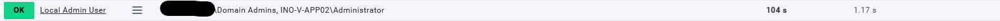

# List Local Admin User

[](https://app.codacy.com/gh/dlothmann/List_Local_Admin_User?utm_source=github.com&utm_medium=referral&utm_content=dlothmann/List_Local_Admin_User&utm_campaign=Badge_Grade)


This plugin is designed to provide a list of members of the local Administrator group with SID ```S-1-5-32-544``` in Windows to CheckMK.

If you have an enterprise edition please follow this [guide](https://docs.checkmk.com/latest/en/mkps.html#wato) from the CheckMK manual to install the pakage.

If you have an raw edition please follow this [guide](https://docs.checkmk.com/latest/en/mkps.html#commandline) from the CheckMK manual to install the pakage.



---
For further questions feel free to contact me.


